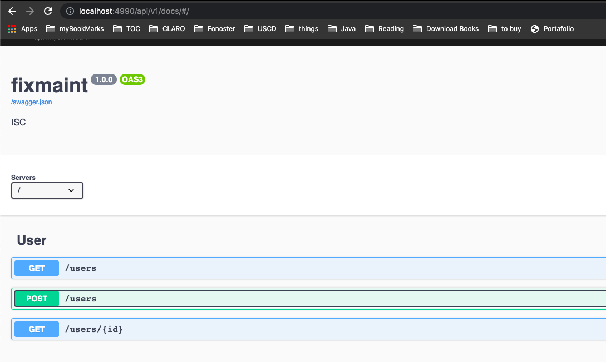

# fixmaint-ws

This is the web services source code for the **Fixmaint App**.

## Build from source

1. Clone the repo

   ```sh
   git clone https://MAZAppFactory@dev.azure.com/MAZAppFactory/Maintenance%20App/_git/MaintApp.API
   cd MaintApp.API
   ```

2. Install dependencies.

   ```sh
   npm install
   ```

3. Build the production server.

   ```sh
   npm build
   ```

4. Run the server.
   ```sh
   npm start
   ```

## Run tests

```sh
npm test 
```

## API Docs
After running this app you can go to the root path in order to see the availables endpoints of this service, as we shown below.

